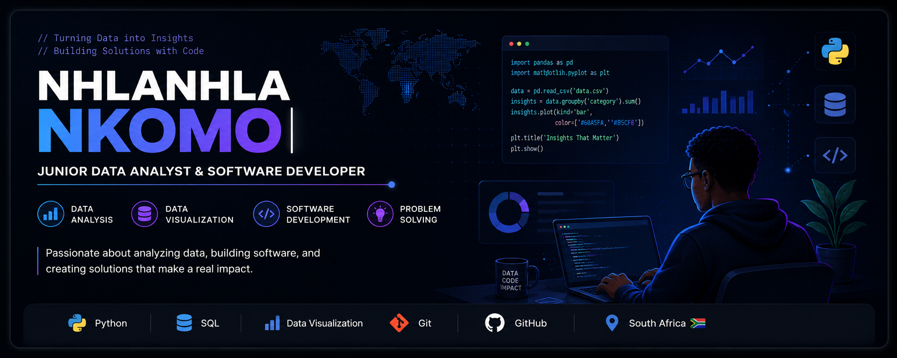

<!-- Custom Banner -->

---

## 👨‍💻 About Me

I'm a **Junior Data Analyst** and **Software Developer** with a passion for solving real-world problems through data and technology.

- 📊 Turning data into meaningful insights
- 💻 Building practical software solutions
- 🧠 Exploring AI-assisted data workflows and automation
- 🌱 Continuously learning and improving my skills
- 🤝 Open to collaborating on software and data projects
- 🚀 Interested in creating applications that make a positive impact

---

## 🛠 Languages & Tools

---

## 📊 GitHub Stats

---

## 📈 Activity Graph

---

## 🐍 Contribution Snake

<!--
  Requires a one-time GitHub Action setup — see the workflow file
  provided alongside this README (.github/workflows/snake.yml).
  Once it runs once, this image will populate automatically every day.
-->

<picture>
<source media="(prefers-color-scheme: dark)" srcset="https://raw.githubusercontent.com/AngeloGeno/AngeloGeno/output/github-snake-dark.svg" />
<source media="(prefers-color-scheme: light)" srcset="https://raw.githubusercontent.com/AngeloGeno/AngeloGeno/output/github-snake.svg" />

</picture>

---

## ⚡ Live Coding Stats (WakaTime)

<!--START_SECTION:waka-->
<!-- This section is auto-filled once the waka.yml workflow runs -->
<!--END_SECTION:waka-->

---

## 🏆 GitHub Trophies

---

## 📫 Connect With Me

- 💼 LinkedIn: [angelo-nkomo](https://www.linkedin.com/in/angelo-nkomo-b05543228/)
- 📧 Email: *(add your email here)*

---

<i>"Turning ideas into software and data into insights."</i>

